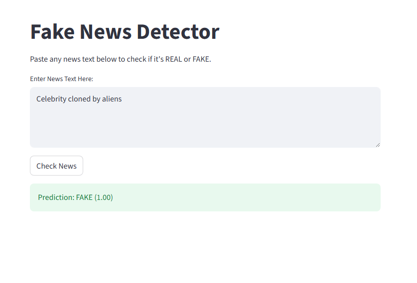

# Day340 - Fake News Detection

Detect whether a news article is **REAL** or **FAKE** using a **pretrained NLP model**.

Live App: [https://fake-news-detection-by-maroofiums.streamlit.app/](https://fake-news-detection-by-maroofiums.streamlit.app/)  
Kaggle Notebook: [https://www.kaggle.com/code/maroofiums/fake-news-detection](https://www.kaggle.com/code/maroofiums/fake-news-detection)  
GitHub Repo: [https://github.com/maroofiums/Fake-News-Detection](https://github.com/maroofiums/Fake-News-Detection)

---

## Project Overview

This project uses a **pretrained transformer model** to classify news text as **REAL** or **FAKE**.  
No training is required. The app works like sentiment analysis but for fake news detection.

Technologies used:

- Hugging Face Transformers
- Streamlit for web interface
- Pretrained Fake News Model

---

## How It Works

The app uses a pretrained text classification model from Hugging Face trained to distinguish between real and fake news. Users can paste any article text into the app and receive a prediction instantly.

---

## Features

- No training required
- Works with any text input
- Live app hosted on Streamlit
- Prediction confidence score displayed

---

## Screenshots

Screenshots are stored in the `screenshots/` folder.

### Input Screen



---

## How to Run Locally

### 1. Clone the Repository

```bash
git clone https://github.com/maroofiums/Fake-News-Detection.git
cd Fake-News-Detection
````

### 2. Create and Activate Virtual Environment

```bash
python -m venv venv
# Windows
./venv/Scripts/activate
# Mac/Linux
source venv/bin/activate
```

### 3. Install Dependencies

```bash
pip install -r requirements.txt
```

### 4. Run the Streamlit App

```bash
streamlit run UI/main.py
```

The app will open in your default browser.

---

## Project Structure

```
Fake-News-Detection/
│
├── UI/            
│   ├── main.py             # Streamlit app
├── README.md               # Project README
|   ├── screenshots/ 
│   └── fake-news-detection.png
└── requirements.txt        # Python dependencies

```

---

## Example Predictions

Input:

> "Scientists discovered a cure for the common cold."

Output:

> REAL (0.93)

Input:

> "Aliens built a secret base on the Moon."

Output:

> FAKE (0.97)

---

## Requirements

* streamlit
* transformers
* torch

Install via:

```bash
pip install streamlit transformers torch
```

---

## Future Improvements

* Add CSV upload for batch prediction
* Add summary dashboard showing REAL vs FAKE counts
* Add explainability with SHAP or LIME
* Deploy as a combined API + web interface

---

## Author

**Maroof** - AI/ML Developer<br>
GitHub: [https://github.com/maroofiums](https://github.com/maroofiums)<br>
Kaggle: [https://www.kaggle.com/maroofiums](https://www.kaggle.com/maroofiums)<br>
Streamlit App: [https://fake-news-detection-by-maroofiums.streamlit.app/](https://fake-news-detection-by-maroofiums.streamlit.app/)

---